# 🌦️ Weather App
A very simple weather app demonstrating **clean architecture**, **code organisation**, **loose coupling**, **unit testing**  and some of the best practices used in modern iOS programming using `Swift`, `SwiftUI` and `SwiftData`

## 📱 App Goal
- Search by city name or postcode
Implement a search to allow the user to enter a city name or postcode. The result of the search is to display the current weather information for the searched location.
- Recent Searches
Implement a screen that lists recently searched locations. You can tap on a recent search location and see the current weather location.
- Delete recent searches
Provide the ability to delete one or more recently searched locations.

## 💡 Weather API
OpenWeatherMap API: http://openweathermap.org/api

For simple query mechanism, I have used weather search by `city name` end the endpoint available here:
[https://api.openweathermap.org/data/2.5/weather?q={city name},{country code}&appid={API key}](https://openweathermap.org/current#name)

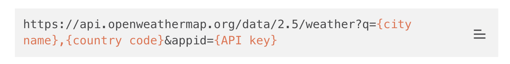

✋🏼NOTE: This endpoint returns response of a single city's weather matched by the query param (`q`). 
If we don't pass any `country code` to the param, then it performs a `global search`.
This ends up showing too many results while typing `London` for example, it searches for `Lon` and `London` successfully. Similarly, searches for `Melbourne`, results in `Mel`, `Melbourn` and so on which are valid global cities.

To avoid this fuzzy searching scenario which results in random city responses across the world, I have restricted search to Australia 🇦🇺 only by appending
`,au` in the query param, which shows predictable Australia only city names and the same endpoint support zip codes specific to Australia.
Please see the technical note left inside `WeatherUseCase.swift` file regarding this.

This can be improved in the app if we change the UX.
 - Step-1 api call: Search for a city globally across the world.
 We can use the `https://openweathermap.org/api/geocoding-api` to list the list of cities first on the UI. Each city response would have `(latitude, longitude)` information
 - Step-2 api call: Tap on a city name from the list. Then fetch the weather for the tapped city's `(lat, lon)` and that would uniquely return the city's weather
 

## 👨🏽‍💻 Solution Approach

> To break down the app layers and architecture as per best practice, I tried to resemble `Clean-Architecture` pattern which is very close to well known VIPER pattern. Actually, I adopted clean `MVVM` with integration to `UseCase` layer.

>> A good reference article here: [clean-architecture-swiftui](https://nalexn.github.io/clean-architecture-swiftui/) 

| Clean Architecture with MVVM |
| ---------------------------  |
| 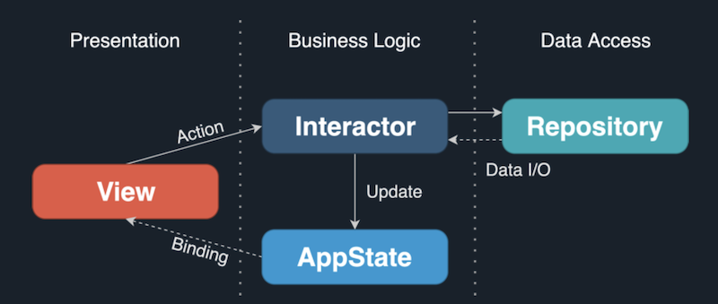 |

The Codebase is broken down into 4 logical layers (via `Swift Packages`)
- `DataLayer`:
    - Network fetching of raw data and JSON decoding via URL, error code mapping etc.
- `DomainLayer`:
    - Business logic of fetching the weather data, query processing and management, relevant transformation, potential chaining of data sources to connect multiple remote services together
    - `UseCase`s live here (aka. `Interactor` in some codebases)
- `PresentationLayer`:
    - Domain data to SwiftUI binding logic
    - All UI specific code (SwiftUI)
- `SharedUtils`:
    - Common light weight utility helpers and extensions
- A mix of **`MVVM`** and **`VIPER`** design pattern is used to achieve loose coupling and unit testing via **`Dependency Injection`** patterns, spy & mocks
- Currently using Apple's `Combine` based `Reactive Binding`
- ✋🏽`TODO`: Migrate from `Combine` driven Publishers into `Swift`'s **Modern Concurrency Async Await** paradigm (probably `UseCase` can adopt this)
- `Unit Testing` is covered in each core layer's functionality & logic, except SwiftUI view's local logic
- Some TODO notes left in the code deliberately for potential improvements and SwiftLint warns us about those to trace them

The package dependencies (import logic from one to another) are shown below:

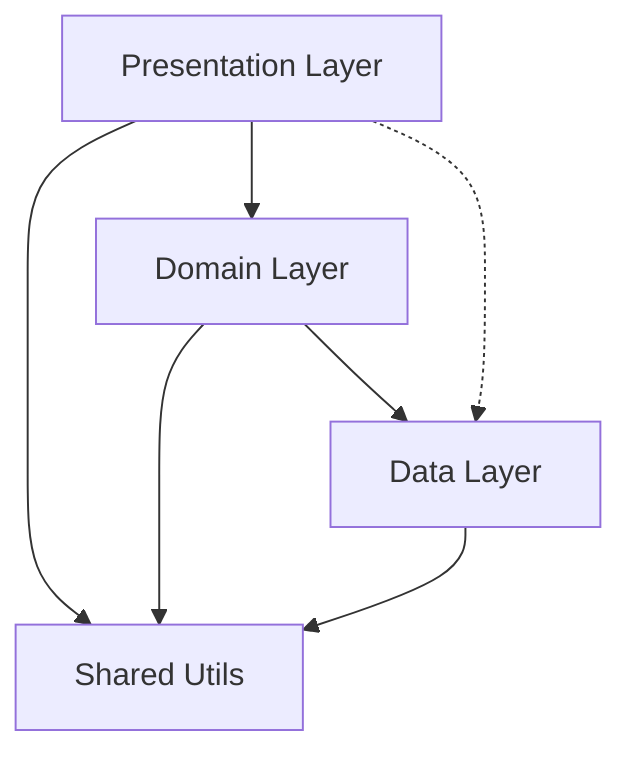

Please refer from the project navigator in Xcode to see the layering.

| Project  | Targets | Tests |
| ------ | -------- | ---- |
| 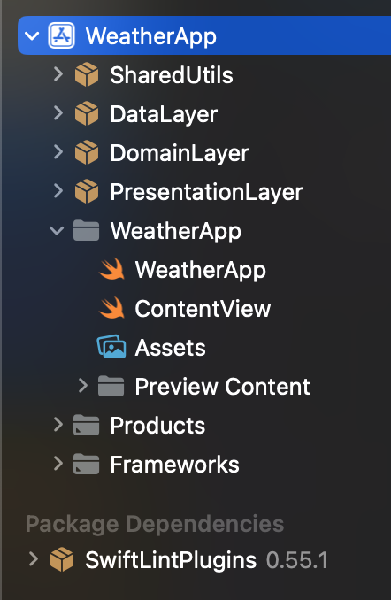  |  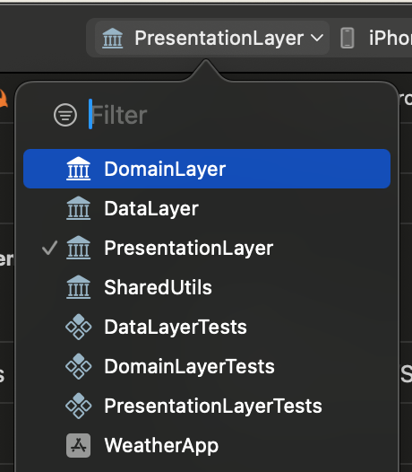   |   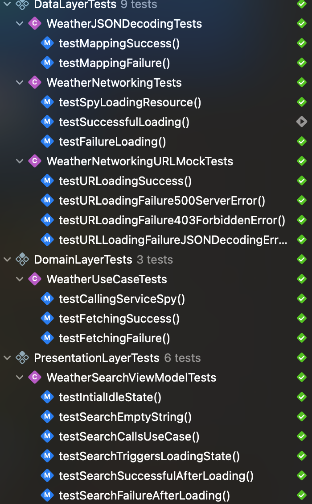  |

## The overall summary in terms of UML 

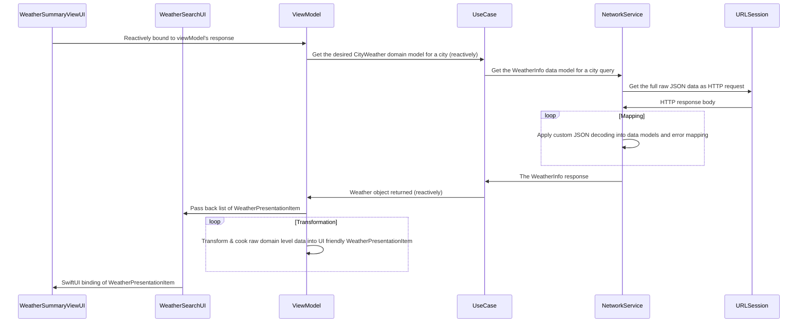

## 💻 Installation & Testing
 - `Xcode 15` or later (required)
 - Clean the `/DerivedData` folder if any
 - Let the Swift package Manager load and sync
 - Build the project and let the Swift Package Manager pulls the remote **`SwiftLint`** plugin
 - **iOS 17** minimum support for the app
    - To be able to use the new `SwiftData` framework
 
 ## 🛠️ Use of Apple Frameworks
  - `SwiftUI`
  - `SwiftData`
  - `Combine`
  - No 3rd party libraries used

## Screenshots

| Scenario 1 | Scenario 2 | Scenario 2 |
| ------ | ---- | ---- |
|   |   |   |

| Screen 1 | Screen 2 | Screen 3 |
| ------ | ---- | ----- |
|  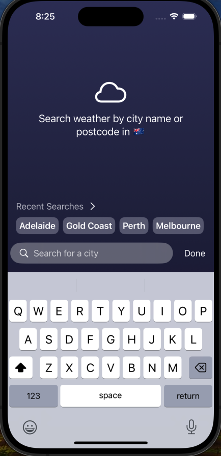 | 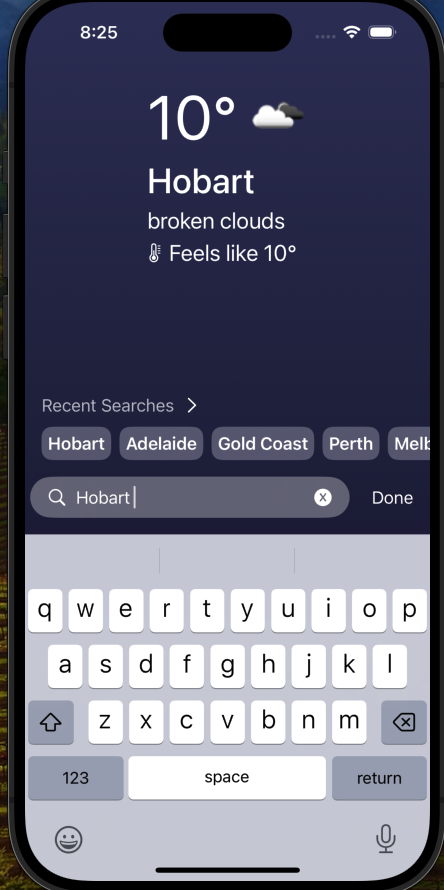  | 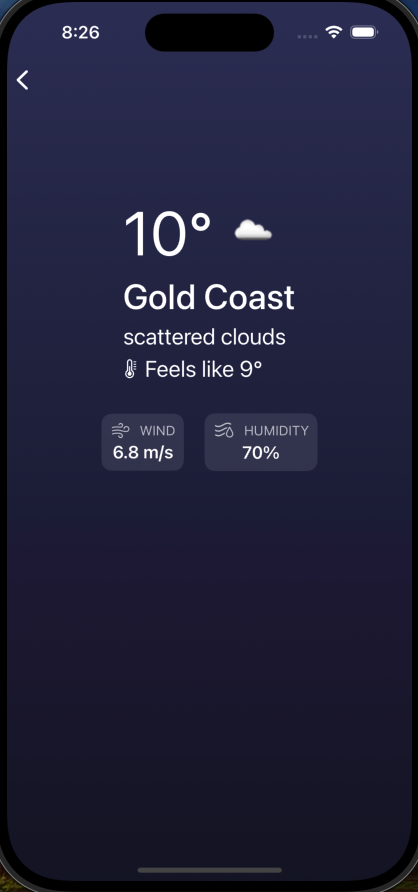 |

## ⛈️ Error Handling UX
- Custom error UI is shown when loading error occurs
- `NetworkFailure` (i.e. internet disconnected) shows its custom message and animated icon
- All other server errors have a generic message and animated icon
- If 404 `NotFound` error returned that means city not found, which is shown slightly differently to fix the city name or post code

| Generic Sever Error | Internet Lost Error |
| ---- | --- |
| Modify the API KEY in `ApiConstants.swift` to something incorrect | Disconnect WiFi & connect back and test |
|   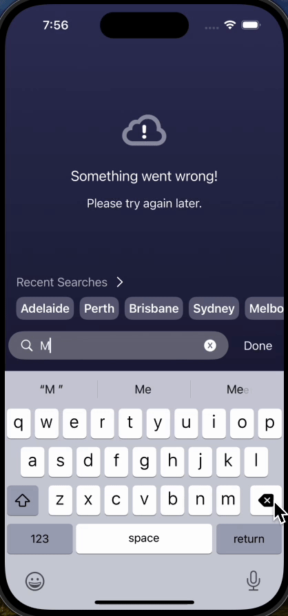 |   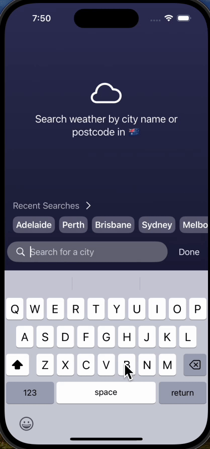 |
